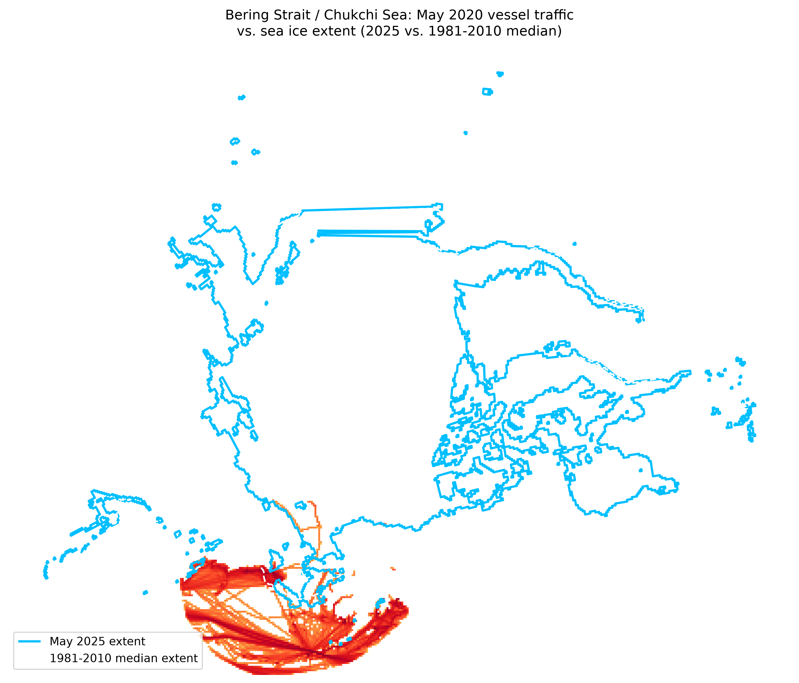

# <h1 align="center">**Arctic Ice Retreat vs. New Shipping Routes**</h1>


<p align="justify">Sixth project in my oceanographic data series. This one crosses three independent public datasets — long-term Arctic sea ice extent, regional sea ice age, and Arctic marine vessel traffic — to test whether the retreat of Arctic sea ice lines up with a rise in shipping activity through a corridor that used to be ice-choked for most of the year: the Bering Strait and the Chukchi Sea, the Pacific gateway to the Northern Sea Route. It combines a multi-decade time series, a regional geospatial cross-section, and a climate storytelling angle in one pipeline.</p>


**Development environment:** Visual Studio Code (VS Code)


**Project status:** _Completed_ — Python and SQL


## Why This Dataset


<p align="justify">This is a direct follow-up to the second project in this series (Arctic Sea Ice Age Analysis), which flagged the connection between shrinking multi-year ice and the opening of shipping routes as a natural next step rather than fully exploring it. This project picks that thread up on purpose: does the same retreat that shows up in a long-run extent series also show up as more vessel traffic in a corridor that ice used to block?</p>


<p align="justify">The region chosen — Bering Strait through the Chukchi Sea — isn't arbitrary: it's the only public, freely downloadable vessel-traffic dataset for the Arctic I could find without an application/approval process (the "official" Arctic Council traffic database, ASTD, is access-restricted). That data availability constraint ended up shaping the whole project: instead of a single clean time series like the sea ice age project, this one has to reconcile three sources that don't share a temporal window, a spatial resolution, or even a coordinate reference system — which is most of what made it harder than a single-source analysis.</p>


Questions I'm trying to answer:


<table align="center">
  <tr>
    <th>Question</th>
    <th>Approach</th>
  </tr>
  <tr>
    <td>How has May Arctic sea ice extent changed over the long run?</td>
    <td>NSIDC Sea Ice Index, monthly May values, 1979-present</td>
  </tr>
  <tr>
    <td>Does regional vessel traffic track sea ice extent in the years both are available?</td>
    <td>Pearson correlation, extent vs. total and per-vessel-type traffic, 2015-2020</td>
  </tr>
  <tr>
    <td>Which vessel type grew the most as ice retreated?</td>
    <td>Per-type change and correlation, cargo/tanker/fishing/other</td>
  </tr>
  <tr>
    <td>What does the ice edge look like today against the historical baseline?</td>
    <td>2025 ice extent polygon vs. the 1981-2010 median extent line</td>
  </tr>
  <tr>
    <td>What did the region's ice age structure look like in the most recent years?</td>
    <td>Regional mean sea ice age and concentration-by-category, May 2020-2025</td>
  </tr>
  <tr>
    <td>Where does traffic actually overlap the retreating ice edge?</td>
    <td>Geospatial map: 2020 vessel traffic raster + 2025 ice extent + historical median</td>
  </tr>
</table>


## Dataset


<p align="justify">
Three independent sources, none originally built to be used together — a long-term climate index, a vessel-traffic raster product, and a polar research NetCDF product. Reconciling them (different years covered, different native resolutions, different coordinate systems) is most of the engineering in this project.
</p>


<table align="center">
  <tr>
    <th>Source</th>
    <th>What it provides</th>
    <th>Coverage used</th>
  </tr>
  <tr>
    <td><a href="https://noaadata.apps.nsidc.org/NOAA/G02135/north/monthly/data/">NSIDC Sea Ice Index (G02135)</a></td>
    <td>Monthly Arctic sea ice extent, million km²</td>
    <td>May, 1979-2026 (long-term series); 2025 extent polygon/polyline + 1981-2010 median polyline for the map</td>
  </tr>
  <tr>
    <td>Kelly Kapsar, Benjamin Sullender, & Aaron Poe (2022). <a href="https://doi.org/10.18739/A2NZ80R4J">North Pacific and Arctic Marine Vessel Traffic Dataset (2015-2020); 10 Kilometer Resolution</a>. Arctic Data Center.</td>
    <td>Monthly vessel-track-length raster, by vessel type (cargo/tanker/fishing/other)</td>
    <td>Kept as a resolution-comparison sample, not the primary analysis (see <em>Data Quality</em>)</td>
  </tr>
  <tr>
    <td>Kelly Kapsar, Benjamin Sullender, & Aaron Poe (2022). <a href="https://doi.org/10.18739/A2J678Z16">North Pacific and Arctic Marine Vessel Traffic Dataset (2015-2020); 25 Kilometer Resolution</a>. Arctic Data Center.</td>
    <td>Same as above, coarser grid</td>
    <td>Primary traffic source — May, 2015-2020, all 4 vessel types</td>
  </tr>
  <tr>
    <td><a href="https://data.marine.copernicus.eu/product/SEAICE_ARC_PHY_AUTO_L4_MY_011_025/description">Copernicus Marine Service — Arctic Sea Ice Age Analysis</a> (same product as project 2)</td>
    <td>Daily gridded sea ice age + concentration by age category</td>
    <td>Daily files, May only, 2020-2026</td>
  </tr>
</table>


### Study region and time window


<p align="justify">
Bounding box: <code>lon -180 to -145, lat 55 to 72</code> — Bering Strait through the Chukchi Sea, matching the footprint of the Kapsar et al. traffic dataset. The NSIDC extent shapefiles and the Copernicus sea ice age grid are both clipped/masked to this same box before any regional statistic is computed, so all three sources describe the same patch of ocean even though they were never designed to be compared.
</p>


<p align="justify">
The three sources do not share a common time window, which shapes what can and can't be statistically tested:
</p>


<ul>
  <li align="justify"><strong>NSIDC extent (1979-2026)</strong> is the only source long enough to show the multi-decade retreat on its own — it's the backdrop, not something being correlated against traffic for every year.</li>
  <li align="justify"><strong>Vessel traffic (2015-2020)</strong> sets the hard boundary for any actual correlation test: extent vs. traffic can only be checked in the six years both exist.</li>
  <li align="justify"><strong>Sea ice age (2020-2026)</strong> only overlaps the traffic window in a single year (2020) — not enough to correlate against traffic over time, so it's used as a recent geospatial/storytelling snapshot instead of a statistical variable.</li>
</ul>


## What I Did


<table align="center">
  <tr><th align="center">Step</th><th align="center">Script</th><th align="center">Purpose</th></tr>
  <tr><td align="center">01</td><td><code>python/import_os.py</code></td><td align="justify">Create the project's folder structure before processing anything</td></tr>
  <tr><td align="center">02</td><td><code>python/inspect_sources.py</code></td><td align="justify">Inspect all four raw formats (CSV, shapefile, GeoTIFF, NetCDF) — dimensions, CRS, nodata, resolution — before any aggregation</td></tr>
  <tr><td align="center">03</td><td><code>python/define_region.py</code></td><td align="justify">Define the Bering Strait / Chukchi Sea study polygon once in lat/lon, then reproject it into each source's native CRS</td></tr>
  <tr><td align="center">04</td><td><code>python/extract_traffic.py</code></td><td align="justify">Clip the Kapsar rasters to the study region; compute regional mean/sum traffic per vessel type, May 2015-2020</td></tr>
  <tr><td align="center">05</td><td><code>python/extract_ice_age.py</code></td><td align="justify">Same regional clipping logic for the Copernicus daily files, May 2020-2025</td></tr>
  <tr><td align="center">06</td><td><code>python/build_timeseries.py</code> + <code>sql/queries.sql</code></td><td align="justify">Merge extent + traffic into SQLite; correlation test, ranking, decade trend, per-vessel-type change</td></tr>
  <tr><td align="center">07</td><td><code>python/critical_map.py</code></td><td align="justify">Geospatial map: 2020 total vessel traffic vs. 2025 ice extent vs. the 1981-2010 historical median</td></tr>
</table>


**Three coordinate systems, reconciled without ever reprojecting a raster**


<p align="justify">
Each source arrived in its own CRS: the Kapsar rasters in a custom Albers Equal Area Conic (NAD83, standard parallels 55°/65°, centered on -154° longitude — read directly from the GeoTIFF's GeoKeys), the NSIDC shapefiles in NSIDC Polar Stereographic North (Hughes 1980 datum), and the Copernicus grid in its own polar layout with non-standard coordinate names (see below). Rather than reprojecting any raster or NetCDF grid — expensive, and lossy from resampling — the single study-region polygon is defined once in plain lat/lon and reprojected into whichever CRS each source needs, the same principle used for the point data in the marine biodiversity project.
</p>


```python
albers_kapsar = (
    "+proj=aea +lat_1=55 +lat_2=65 +lat_0=50 +lon_0=-154 "
    "+x_0=0 +y_0=0 +datum=NAD83 +units=m +no_defs"
)
region_albers = region_wgs84.to_crs(albers_kapsar)
```


<p align="justify">
The one exception is <code>critical_map.py</code>, where the traffic raster and the ice extent vector layer genuinely need to sit on the same canvas to be plotted together. There, the raster (not the polygon) is reprojected — checked first so the reprojection only runs if the two CRSs actually differ:
</p>


```python
if str(traffic_crs) != str(extent_2025.crs):
    new_transform, new_width, new_height = calculate_default_transform(
        traffic_crs, albers_kapsar, traffic_width, traffic_height, left, bottom, right, top
    )
    reproject(
        source=source_data,
        destination=destination_data,
        src_transform=traffic_transform,
        src_crs=traffic_crs,
        dst_transform=new_transform,
        dst_crs=albers_kapsar,
        resampling=Resampling.bilinear,
    )
```


**A coordinate-naming bug that broke the first version of the ice age script**


<p align="justify">
The Copernicus grid doesn't expose <code>longitude</code>/<code>latitude</code> as selectable dimensions the way the same product did in project 2 — a first version of <code>extract_ice_age.py</code> failed on every single file with <code>'Longitude coordinate not found'</code>. The fix detects the actual coordinate (or data variable) names instead of assuming a fixed pair, and skips — rather than crashes on — any file where neither can be found:
</p>


```python
def find_lat_lon_names(dataset):
    lat_name = next((c for c in dataset.coords if "lat" in c.lower()), None)
    lon_name = next((c for c in dataset.coords if "lon" in c.lower()), None)
    if lat_name is None:
        lat_name = next((v for v in dataset.data_vars if "lat" in v.lower()), None)
    if lon_name is None:
        lon_name = next((v for v in dataset.data_vars if "lon" in v.lower()), None)
    return lat_name, lon_name
```


<p align="justify">
That same debugging pass also surfaced that the Copernicus download isn't one file per month like project 2 — it's <strong>one file per day</strong>, organized into per-year folders (<code>arctic_ice_age/may2020/</code>, <code>may2021/</code>, …). <code>extract_ice_age.py</code> reads every daily file, computes the regional mean per day, and only then averages up to one row per year.
</p>


**Regional traffic extraction (raster masking)**


```python
with rasterio.open(path) as src:
    clipped, _ = mask(src, geometry, crop=True, nodata=src.nodata)
    values = clipped[0]
    values = values[values != src.nodata]
    mean_traffic = float(values.mean())
```


**Correlation with an explicit small-sample warning**


<p align="justify">
With only six overlapping years (2015-2020), any correlation here is a directional signal, not a confident statistical result — the script says so at the point the numbers are computed, rather than leaving that caveat implicit:
</p>


```python
if len(combined_df) < 6:
    print("WARNING: only", len(combined_df), "overlapping years -- "
          "treat any correlation below as indicative, not conclusive.")


r, p = stats.pearsonr(combined_df["extent_million_km2"], combined_df["total_traffic"])
```


## Data Quality


<p align="justify">Known data quality points, checked and resolved (or deliberately worked around) rather than assumed away:</p>


<ul>
  <li align="justify"><strong>Mixed raster resolutions in the raw downloads.</strong> Both 10km and 25km versions of the Kapsar dataset ended up downloaded across different sampling attempts. <code>inspect_sources.py</code> checks every <code>.tif</code> found and raises a warning if more than one resolution is present. The project standardizes on <strong>25km</strong> for the main analysis — it's the resolution most of the sample downloads landed on, and it's a better match for the coarser NSIDC/Copernicus grids than 10km would be. The 10km files are kept as a future resolution-sensitivity check, not deleted.</li>
  <li align="justify"><strong>Non-standard coordinate names in the Copernicus files</strong> (see <em>What I Did</em> above) — every file is checked for a usable lat/lon pair before aggregation; files where neither can be found are skipped and listed, not silently dropped.</li>
  <li align="justify"><strong>The three sources' time windows only partially overlap</strong> (1979-2026 / 2015-2020 / 2020-2025). This isn't a flaw to fix, but it does mean the ice-age-vs-traffic comparison is a single-year snapshot (2020) rather than a correlation, and that's reflected in how <em>Results</em> below is split into two parts rather than one combined test.</li>
  <li align="justify"><strong>Six data points is a small sample for a Pearson correlation.</strong> <code>build_timeseries.py</code> flags this explicitly rather than reporting a p-value without context — see the code snippet above.</li>
</ul>


## Database Structure


<table align="center">
  <tr><th align="center">Table</th><th align="center">Expected rows</th><th align="center">What's in it</th></tr>
  <tr><td align="center"><code>ice_extent_long_term</code></td><td align="center">~48</td><td align="justify">May Arctic sea ice extent, 1979-2026, from the NSIDC Sea Ice Index — the long-run backdrop series</td></tr>
  <tr><td align="center"><code>ice_extent_vs_traffic</code></td><td align="center">6</td><td align="justify">May extent joined to regional vessel traffic by year and type, 2015-2020 — the table the correlation test runs on</td></tr>
  <tr><td align="center"><code>ice_age_recent</code></td><td align="center">6</td><td align="justify">Regional mean sea ice age and concentration by category, May 2020-2025 — the recent geospatial/storytelling layer</td></tr>
</table>


<p align="justify">Row counts above are the pipeline's design targets, based on the years each source covers — to be confirmed once <code>build_timeseries.py</code> runs against the full downloaded set.</p>


## Visualisations


**Critical map: 2020 traffic vs. the retreating ice edge**


<p align="justify">
<code>critical_map.py</code> overlays the total May 2020 vessel traffic (all four types combined, log-scaled so the busiest cells don't wash out the rest) against the May 2025 ice extent polygon and the 1981-2010 median extent line, all reprojected onto the same Albers Equal Area canvas centered on the Bering Strait / Chukchi Sea.
</p>


<p align="center">
  
</p>


<p align="justify">
(Map to be generated once the full 25km traffic set for May 2020 is confirmed complete — see <em>Output Files</em>.)
</p>


## Output Files


<table align="center">
  <tr><th align="center">File</th><th align="center">Description</th></tr>
  <tr><td align="center"><code>data/raw/N_05_extent_v4.0.csv</code></td><td align="justify">NSIDC long-term May extent series, 1979-2026</td></tr>
  <tr><td align="center"><code>data/raw/extent_N_202505_polygon_v4.0/</code></td><td align="justify">May 2025 ice extent, polygon shapefile</td></tr>
  <tr><td align="center"><code>data/raw/extent_N_202505_polyline_v4.0/</code></td><td align="justify">May 2025 ice extent, polyline shapefile</td></tr>
  <tr><td align="center"><code>data/raw/median_extent_N_05_1981-2010_polyline_v4.0/</code></td><td align="justify">1981-2010 May median extent, the historical baseline line</td></tr>
  <tr><td align="center"><code>data/raw/arctic_marine_vessel_traffic/25km/Raster_YYYY_05_TYPE_25km.tif</code></td><td align="justify">Kapsar et al. monthly traffic rasters, May 2015-2020, 4 vessel types, 25km resolution</td></tr>
  <tr><td align="center"><code>data/raw/arctic_ice_age/mayYYYY/*.nc</code></td><td align="justify">Copernicus daily sea ice age files, May 2020-2025</td></tr>
  <tr><td align="center"><code>data/processed/study_region_wgs84.geojson</code>, <code>study_region_albers.geojson</code>, <code>study_region_polar_stereo.geojson</code></td><td align="justify">The Bering Strait / Chukchi study polygon, reprojected into each source's native CRS</td></tr>
  <tr><td align="center"><code>data/processed/traffic_by_year_type.csv</code>, <code>traffic_by_year_wide.csv</code></td><td align="justify">Regional traffic by vessel type and year, long and wide format</td></tr>
  <tr><td align="center"><code>data/processed/ice_age_daily_regional.csv</code>, <code>ice_age_by_year.csv</code></td><td align="justify">Regional sea ice age/concentration, daily and annual</td></tr>
  <tr><td align="center"><code>database/arctic_shipping_routes.db</code></td><td align="justify">SQLite database with the three tables described above</td></tr>
  <tr><td align="center"><code>visualisations/critical_map_bering_chukchi.png</code></td><td align="justify">Traffic vs. ice extent map</td></tr>
</table>


## Results


<p align="justify">
<em>Pending final pipeline run.</em> The extraction and database-loading scripts are complete and syntax-checked, but the correlation figures, per-vessel-type breakdown, and decade-over-decade extent trend haven't been generated against the full confirmed dataset yet. This section will report:
</p>


<ul>
  <li align="justify">The long-term May extent trend (1979-2026) and how much of it falls before vs. within the 2015-2020 traffic window</li>
  <li align="justify">Extent vs. total traffic correlation, 2015-2020, plus the same test broken out per vessel type</li>
  <li align="justify">Which vessel type grew the most over that window, in absolute and relative terms</li>
  <li align="justify">What the 2020 snapshot (the only year ice age and traffic overlap) shows geospatially, read alongside the map above</li>
</ul>


## Limitations


<p align="justify">
The central limitation is structural, not a data quality slip: the three sources cover different windows, so no single test spans all of them. The extent-vs-traffic correlation is real but rests on only six years — a p-value from that sample should be read as directional, not conclusive, exactly as the pipeline itself flags at runtime. The ice-age-vs-traffic comparison is weaker still: with only 2020 in common, it can only be shown as a single map, never tested statistically.
</p>
<p align="justify">
The Kapsar traffic dataset also stops in 2020 — five years before the most recent Copernicus and NSIDC data used here. Nothing in this project can speak to whether traffic kept rising after 2020 in this corridor; that would need either an updated version of the traffic dataset or a switch to a different traffic source (e.g. AIS-derived data with an application process, like ASTD).
</p>


## Notes


<p align="justify">
<strong>Why this corridor, specifically.</strong> The Bering Strait is the only entry point between the Pacific and the Arctic Ocean — every ship using the Northern Sea Route from the Pacific side has to pass through it. That makes it one of the clearest places in the world to look for a direct link between ice retreat and new shipping activity, rather than a diffuse, basin-wide correlation.
</p>
<p align="justify">
<strong>Why this is a genuine "new routes" question, not just a traffic question.</strong> For most of the 20th century, this corridor was ice-covered for most of the year, making it commercially irrelevant to shipping outside a short summer window. A measurable rise in traffic here isn't just "more ships" in an existing lane — it would be evidence of a lane becoming usable that mostly wasn't before, with real consequences already discussed in the marine-biodiversity project (ship strikes, noise, and disturbance for species that were previously insulated from vessel traffic by ice cover for most of the year).
</p>
<p align="justify">
This project follows directly from the Arctic Sea Ice Age project's closing note, and is a natural candidate for a future third iteration: extending the traffic side past 2020 once a usable public dataset exists, and adding a proper time-series error correction (in the spirit of the Newey-West/ARIMA note in the maritime emissions project) if the correlation holds up under closer inspection.
</p>


## Tools


**Programming and Development**
- Python
- SQL
- Visual Studio Code (VS Code)


**Python Libraries**
- Xarray
- Pandas
- NumPy
- SciPy
- GeoPandas
- Rasterio
- Shapely
- Matplotlib


**Database**
- SQLite


**Data Formats**
- NetCDF
- GeoTIFF
- Shapefile
- CSV
- GeoJSON


## Skills Demonstrated


<p align="center"><i>Python - Xarray - NetCDF Processing - GeoPandas - Rasterio - Raster Masking - Coordinate Reference Systems - Multi-source Data Integration - SQL - SQLite - Statistical Testing - Small-Sample Caution - Data Visualisation - Geospatial Analysis - Oceanographic Data - Climate Data Storytelling</i></p>


## Bibliography


- [NSIDC Sea Ice Index (G02135) — monthly data](https://noaadata.apps.nsidc.org/NOAA/G02135/north/monthly/data/)
- Kelly Kapsar, Benjamin Sullender, & Aaron Poe. (2022). [North Pacific and Arctic Marine Vessel Traffic Dataset (2015-2020); 10 Kilometer Resolution](https://doi.org/10.18739/A2NZ80R4J). Arctic Data Center.
- Kelly Kapsar, Benjamin Sullender, & Aaron Poe. (2022). [North Pacific and Arctic Marine Vessel Traffic Dataset (2015-2020); 25 Kilometer Resolution](https://doi.org/10.18739/A2J678Z16). Arctic Data Center.
- [Copernicus Marine Service — Arctic Sea Ice Age Analysis, product description](https://data.marine.copernicus.eu/product/SEAICE_ARC_PHY_AUTO_L4_MY_011_025/description)
- [PAME / Arctic Council — Arctic Ship Traffic Data (ASTD)](https://pame.is/ourwork/arctic-shipping/current-shipping-projects/astd/)


## Author


### Mariana Gomes de Andrade Silva


<p align="justify">Sixth project in my oceanographic data series, and a direct follow-up to the Arctic Sea Ice Age project — crossing long-term ice retreat with Arctic marine vessel traffic through the Bering Strait / Chukchi Sea corridor.</p>


<p align="center"><strong>Interests: Oceanography - Scientific Programming - Data Analysis - Environmental Data</strong></p>


